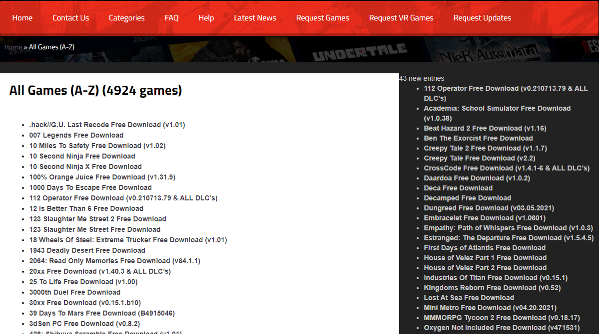

# Steamunlocked

With this script a notification will appear on the page when new games are released. It works on https://steamunlocked.net/all-games/. Makes use of window.localStorage to store the games currently present, so be careful not to have the option of deleting data when exiting the browser. The button UPDATE will add new games to local storage, the button CLEAR will clear the local storage

## Version 1.0.1
 -  Code reorganized for better readability
 -  Added a CLEAR button to clear the tracked games list
 -  Added total games count next to "All games (A-Z)"

## Version 1.0
 - Overlib support: scrolling the mouse over the link, an image preview of the game will appear. IT MAY TAKE SOME TIME TO RETRIEVE THE IMAGE.

Initially written and used with tampermonkey ("http://tampermonkey.net/").

This script may be subject to changes and updates over time.

## Preview

